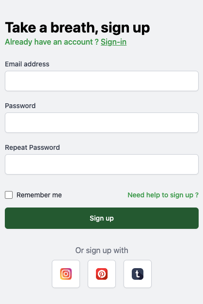

# TailwindCSS-Component: Sign-up page

Welcome to the repository featuring a responsive and visually appealing sign-up component crafted using TailwindCSS. 
Designed to provide a straightforward and engaging user registration experience, this component features a simple form along with social media sign-up options. 
The component is easily customizable and made accessible via TailwindCSS Play CDN, ensuring quick integration without local installation.

## Features

- Responsive design to accommodate various devices and screen sizes.
- Simple and clean user interface for a hassle-free sign-up process.
- Social media sign-up options for enhanced accessibility and convenience.
- Utilizes TailwindCSS via Play CDN for effortless use.

## Preview

Desktop view:


Mobile view:



## Usage

To use this sign-up component in your project, copy the HTML and CSS from the `signup.html` file located in this repository. Make sure to include the following TailwindCSS CDN link if it's not already part of your project:

```html
<!-- TailwindCSS CDN for immediate use -->
<link href="https://cdn.tailwindcss.com" rel="stylesheet">
```

## Access

You can view a live demo of the sign-up component here: https://eliottdelhaye.github.io/ailwindCSS-Component-Sign-Up-Page/
